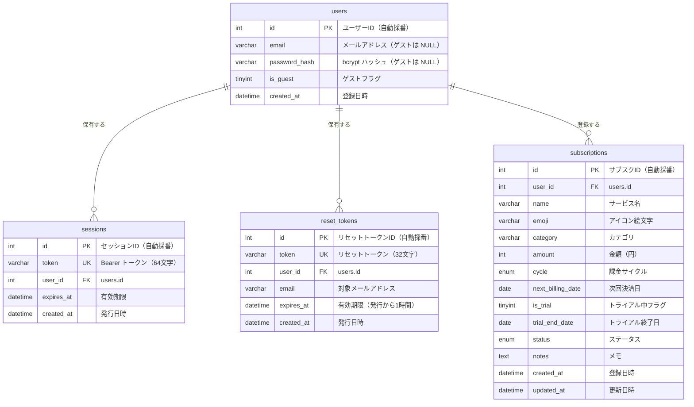

# データベース設計仕様書

## 概要

| 項目 | 内容 |
|---|---|
| DBMS | MySQL 8.0 以上 |
| 文字セット | `utf8mb4`（絵文字対応） |
| 照合順序 | `utf8mb4_unicode_ci` |
| ストレージエンジン | InnoDB（外部キー制約・トランザクション対応） |
| タイムゾーン | サーバーの `time_zone` を `+09:00`（JST）に設定推奨 |

---

## ER 図



---

## テーブル定義

### `users` — ユーザー

ゲストユーザーは `email`・`password_hash` が `NULL`、`is_guest = 1` となる。

| カラム名 | 型 | NOT NULL | デフォルト | 説明 |
|---|---|---|---|---|
| `id` | `INT UNSIGNED` | ✓ | AUTO_INCREMENT | ユーザーID（PK） |
| `email` | `VARCHAR(255)` | — | NULL | メールアドレス。ゲストは NULL。 |
| `password_hash` | `VARCHAR(255)` | — | NULL | bcrypt ハッシュ値。ゲストは NULL。 |
| `is_guest` | `TINYINT(1)` | ✓ | `0` | ゲストユーザーかどうか（1=ゲスト） |
| `created_at` | `DATETIME` | ✓ | `CURRENT_TIMESTAMP` | 登録日時 |

**制約・インデックス**

| 種別 | 対象カラム | 名前 | 備考 |
|---|---|---|---|
| PRIMARY KEY | `id` | — | |
| UNIQUE | `email` | `uq_users_email` | NULL は除外（ゲスト複数許容） |
| INDEX | `is_guest` | `idx_users_is_guest` | ゲスト一括削除バッチ用 |

```sql
CREATE TABLE users (
    id            INT UNSIGNED    NOT NULL AUTO_INCREMENT,
    email         VARCHAR(255)    NULL,
    password_hash VARCHAR(255)    NULL,
    is_guest      TINYINT(1)      NOT NULL DEFAULT 0,
    created_at    DATETIME        NOT NULL DEFAULT CURRENT_TIMESTAMP,
    PRIMARY KEY (id),
    UNIQUE KEY uq_users_email (email),
    INDEX idx_users_is_guest (is_guest)
) ENGINE=InnoDB DEFAULT CHARSET=utf8mb4 COLLATE=utf8mb4_unicode_ci;
```

---

### `sessions` — セッション

ログイン中のトークンを管理する。有効期限は **30日間**。
期限切れレコードは定期バッチで削除することを推奨。

| カラム名 | 型 | NOT NULL | デフォルト | 説明 |
|---|---|---|---|---|
| `id` | `INT UNSIGNED` | ✓ | AUTO_INCREMENT | セッションID（PK） |
| `token` | `VARCHAR(64)` | ✓ | — | Bearer トークン（32バイトの hex 文字列） |
| `user_id` | `INT UNSIGNED` | ✓ | — | 紐づくユーザーID（FK → `users.id`） |
| `expires_at` | `DATETIME` | ✓ | — | トークンの有効期限（発行から30日後） |
| `created_at` | `DATETIME` | ✓ | `CURRENT_TIMESTAMP` | 発行日時 |

**制約・インデックス**

| 種別 | 対象カラム | 名前 | 備考 |
|---|---|---|---|
| PRIMARY KEY | `id` | — | |
| UNIQUE | `token` | `uq_sessions_token` | トークンの一意性を保証 |
| INDEX | `user_id` | `idx_sessions_user_id` | ユーザー別セッション検索用 |
| INDEX | `expires_at` | `idx_sessions_expires_at` | 期限切れ一括削除バッチ用 |
| FOREIGN KEY | `user_id` | `fk_sessions_user_id` | ユーザー削除時に CASCADE DELETE |

```sql
CREATE TABLE sessions (
    id         INT UNSIGNED  NOT NULL AUTO_INCREMENT,
    token      VARCHAR(64)   NOT NULL,
    user_id    INT UNSIGNED  NOT NULL,
    expires_at DATETIME      NOT NULL,
    created_at DATETIME      NOT NULL DEFAULT CURRENT_TIMESTAMP,
    PRIMARY KEY (id),
    UNIQUE KEY uq_sessions_token (token),
    INDEX idx_sessions_user_id (user_id),
    INDEX idx_sessions_expires_at (expires_at),
    CONSTRAINT fk_sessions_user_id
        FOREIGN KEY (user_id) REFERENCES users (id) ON DELETE CASCADE
) ENGINE=InnoDB DEFAULT CHARSET=utf8mb4 COLLATE=utf8mb4_unicode_ci;
```

---

### `reset_tokens` — パスワードリセットトークン

パスワードリセット用の一時トークンを管理する。有効期限は **1時間**。
1ユーザーにつき有効なトークンは常に1件のみ（発行時に旧トークンを削除）。

| カラム名 | 型 | NOT NULL | デフォルト | 説明 |
|---|---|---|---|---|
| `id` | `INT UNSIGNED` | ✓ | AUTO_INCREMENT | リセットトークンID（PK） |
| `token` | `VARCHAR(32)` | ✓ | — | リセットトークン（16バイトの hex 文字列） |
| `user_id` | `INT UNSIGNED` | ✓ | — | 紐づくユーザーID（FK → `users.id`） |
| `email` | `VARCHAR(255)` | ✓ | — | リセット対象のメールアドレス（申請時点のスナップショット） |
| `expires_at` | `DATETIME` | ✓ | — | トークンの有効期限（発行から1時間後） |
| `created_at` | `DATETIME` | ✓ | `CURRENT_TIMESTAMP` | 発行日時 |

**制約・インデックス**

| 種別 | 対象カラム | 名前 | 備考 |
|---|---|---|---|
| PRIMARY KEY | `id` | — | |
| UNIQUE | `token` | `uq_reset_tokens_token` | トークンの一意性を保証 |
| UNIQUE | `user_id` | `uq_reset_tokens_user_id` | 1ユーザー1トークン制約 |
| INDEX | `expires_at` | `idx_reset_tokens_expires_at` | 期限切れ一括削除バッチ用 |
| FOREIGN KEY | `user_id` | `fk_reset_tokens_user_id` | ユーザー削除時に CASCADE DELETE |

```sql
CREATE TABLE reset_tokens (
    id         INT UNSIGNED  NOT NULL AUTO_INCREMENT,
    token      VARCHAR(32)   NOT NULL,
    user_id    INT UNSIGNED  NOT NULL,
    email      VARCHAR(255)  NOT NULL,
    expires_at DATETIME      NOT NULL,
    created_at DATETIME      NOT NULL DEFAULT CURRENT_TIMESTAMP,
    PRIMARY KEY (id),
    UNIQUE KEY uq_reset_tokens_token (token),
    UNIQUE KEY uq_reset_tokens_user_id (user_id),
    INDEX idx_reset_tokens_expires_at (expires_at),
    CONSTRAINT fk_reset_tokens_user_id
        FOREIGN KEY (user_id) REFERENCES users (id) ON DELETE CASCADE
) ENGINE=InnoDB DEFAULT CHARSET=utf8mb4 COLLATE=utf8mb4_unicode_ci;
```

---

### `subscriptions` — サブスクリプション

ユーザーが登録した月額・年額サービスを管理する。
絵文字（`emoji`）は 4バイト文字を含むため `utf8mb4` が必須。

| カラム名 | 型 | NOT NULL | デフォルト | 説明 |
|---|---|---|---|---|
| `id` | `INT UNSIGNED` | ✓ | AUTO_INCREMENT | サブスクID（PK） |
| `user_id` | `INT UNSIGNED` | ✓ | — | 所有ユーザーID（FK → `users.id`） |
| `name` | `VARCHAR(100)` | ✓ | — | サービス名（例: Netflix） |
| `emoji` | `VARCHAR(10)` | — | NULL | アイコン絵文字（例: 🎬） |
| `category` | `VARCHAR(50)` | — | NULL | カテゴリ（例: 動画、音楽、AI） |
| `amount` | `INT UNSIGNED` | ✓ | — | 金額（円、0より大きい値） |
| `cycle` | `ENUM('monthly','yearly')` | ✓ | `'monthly'` | 課金サイクル |
| `next_billing_date` | `DATE` | ✓ | — | 次回決済日 |
| `is_trial` | `TINYINT(1)` | ✓ | `0` | 無料トライアル中かどうか（1=トライアル中） |
| `trial_end_date` | `DATE` | — | NULL | トライアル終了日（`is_trial=1` の場合に使用） |
| `status` | `ENUM('active','cancelled')` | ✓ | `'active'` | ステータス |
| `notes` | `TEXT` | — | NULL | 任意のメモ |
| `created_at` | `DATETIME` | ✓ | `CURRENT_TIMESTAMP` | 登録日時 |
| `updated_at` | `DATETIME` | ✓ | `CURRENT_TIMESTAMP ON UPDATE CURRENT_TIMESTAMP` | 最終更新日時 |

**制約・インデックス**

| 種別 | 対象カラム | 名前 | 備考 |
|---|---|---|---|
| PRIMARY KEY | `id` | — | |
| INDEX | `user_id` | `idx_subscriptions_user_id` | ユーザー別一覧取得用（最重要） |
| INDEX | `user_id, status` | `idx_subscriptions_user_status` | 有効サブスク絞り込み用 |
| INDEX | `next_billing_date` | `idx_subscriptions_next_billing_date` | 更新日順ソート用 |
| INDEX | `is_trial, trial_end_date` | `idx_subscriptions_trial` | トライアル期限切れアラート用 |
| FOREIGN KEY | `user_id` | `fk_subscriptions_user_id` | ユーザー削除時に CASCADE DELETE |
| CHECK | `amount > 0` | `chk_subscriptions_amount` | 金額が正の値であること |

```sql
CREATE TABLE subscriptions (
    id                INT UNSIGNED                   NOT NULL AUTO_INCREMENT,
    user_id           INT UNSIGNED                   NOT NULL,
    name              VARCHAR(100)                   NOT NULL,
    emoji             VARCHAR(10)                    NULL,
    category          VARCHAR(50)                    NULL,
    amount            INT UNSIGNED                   NOT NULL,
    cycle             ENUM('monthly', 'yearly')      NOT NULL DEFAULT 'monthly',
    next_billing_date DATE                           NOT NULL,
    is_trial          TINYINT(1)                     NOT NULL DEFAULT 0,
    trial_end_date    DATE                           NULL,
    status            ENUM('active', 'cancelled')    NOT NULL DEFAULT 'active',
    notes             TEXT                           NULL,
    created_at        DATETIME                       NOT NULL DEFAULT CURRENT_TIMESTAMP,
    updated_at        DATETIME                       NOT NULL DEFAULT CURRENT_TIMESTAMP
                                                     ON UPDATE CURRENT_TIMESTAMP,
    PRIMARY KEY (id),
    INDEX idx_subscriptions_user_id (user_id),
    INDEX idx_subscriptions_user_status (user_id, status),
    INDEX idx_subscriptions_next_billing_date (next_billing_date),
    INDEX idx_subscriptions_trial (is_trial, trial_end_date),
    CONSTRAINT fk_subscriptions_user_id
        FOREIGN KEY (user_id) REFERENCES users (id) ON DELETE CASCADE,
    CONSTRAINT chk_subscriptions_amount
        CHECK (amount > 0)
) ENGINE=InnoDB DEFAULT CHARSET=utf8mb4 COLLATE=utf8mb4_unicode_ci;
```

---

## データベース作成 DDL（まとめ）

```sql
-- データベース作成
CREATE DATABASE IF NOT EXISTS subscr_optimizer
    CHARACTER SET utf8mb4
    COLLATE utf8mb4_unicode_ci;

USE subscr_optimizer;

-- タイムゾーン設定（JST）
SET time_zone = '+09:00';

-- テーブル作成（外部キー制約のため依存順に実行）
CREATE TABLE users (
    id            INT UNSIGNED    NOT NULL AUTO_INCREMENT,
    email         VARCHAR(255)    NULL,
    password_hash VARCHAR(255)    NULL,
    is_guest      TINYINT(1)      NOT NULL DEFAULT 0,
    created_at    DATETIME        NOT NULL DEFAULT CURRENT_TIMESTAMP,
    PRIMARY KEY (id),
    UNIQUE KEY uq_users_email (email),
    INDEX idx_users_is_guest (is_guest)
) ENGINE=InnoDB DEFAULT CHARSET=utf8mb4 COLLATE=utf8mb4_unicode_ci;

CREATE TABLE sessions (
    id         INT UNSIGNED  NOT NULL AUTO_INCREMENT,
    token      VARCHAR(64)   NOT NULL,
    user_id    INT UNSIGNED  NOT NULL,
    expires_at DATETIME      NOT NULL,
    created_at DATETIME      NOT NULL DEFAULT CURRENT_TIMESTAMP,
    PRIMARY KEY (id),
    UNIQUE KEY uq_sessions_token (token),
    INDEX idx_sessions_user_id (user_id),
    INDEX idx_sessions_expires_at (expires_at),
    CONSTRAINT fk_sessions_user_id
        FOREIGN KEY (user_id) REFERENCES users (id) ON DELETE CASCADE
) ENGINE=InnoDB DEFAULT CHARSET=utf8mb4 COLLATE=utf8mb4_unicode_ci;

CREATE TABLE reset_tokens (
    id         INT UNSIGNED  NOT NULL AUTO_INCREMENT,
    token      VARCHAR(32)   NOT NULL,
    user_id    INT UNSIGNED  NOT NULL,
    email      VARCHAR(255)  NOT NULL,
    expires_at DATETIME      NOT NULL,
    created_at DATETIME      NOT NULL DEFAULT CURRENT_TIMESTAMP,
    PRIMARY KEY (id),
    UNIQUE KEY uq_reset_tokens_token (token),
    UNIQUE KEY uq_reset_tokens_user_id (user_id),
    INDEX idx_reset_tokens_expires_at (expires_at),
    CONSTRAINT fk_reset_tokens_user_id
        FOREIGN KEY (user_id) REFERENCES users (id) ON DELETE CASCADE
) ENGINE=InnoDB DEFAULT CHARSET=utf8mb4 COLLATE=utf8mb4_unicode_ci;

CREATE TABLE subscriptions (
    id                INT UNSIGNED                   NOT NULL AUTO_INCREMENT,
    user_id           INT UNSIGNED                   NOT NULL,
    name              VARCHAR(100)                   NOT NULL,
    emoji             VARCHAR(10)                    NULL,
    category          VARCHAR(50)                    NULL,
    amount            INT UNSIGNED                   NOT NULL,
    cycle             ENUM('monthly', 'yearly')      NOT NULL DEFAULT 'monthly',
    next_billing_date DATE                           NOT NULL,
    is_trial          TINYINT(1)                     NOT NULL DEFAULT 0,
    trial_end_date    DATE                           NULL,
    status            ENUM('active', 'cancelled')    NOT NULL DEFAULT 'active',
    notes             TEXT                           NULL,
    created_at        DATETIME                       NOT NULL DEFAULT CURRENT_TIMESTAMP,
    updated_at        DATETIME                       NOT NULL DEFAULT CURRENT_TIMESTAMP
                                                     ON UPDATE CURRENT_TIMESTAMP,
    PRIMARY KEY (id),
    INDEX idx_subscriptions_user_id (user_id),
    INDEX idx_subscriptions_user_status (user_id, status),
    INDEX idx_subscriptions_next_billing_date (next_billing_date),
    INDEX idx_subscriptions_trial (is_trial, trial_end_date),
    CONSTRAINT fk_subscriptions_user_id
        FOREIGN KEY (user_id) REFERENCES users (id) ON DELETE CASCADE,
    CONSTRAINT chk_subscriptions_amount
        CHECK (amount > 0)
) ENGINE=InnoDB DEFAULT CHARSET=utf8mb4 COLLATE=utf8mb4_unicode_ci;
```

---

## テーブル間のリレーション

```
users (1) ──────< sessions       (多)   ユーザーは複数のセッションを持てる
users (1) ──────< reset_tokens   (多)   ※ user_id に UNIQUE 制約 → 実質 1対1
users (1) ──────< subscriptions  (多)   ユーザーは複数のサブスクを登録できる
```

`users` を削除すると、`ON DELETE CASCADE` により紐づく `sessions`・`reset_tokens`・`subscriptions` がすべて自動削除される（退会処理に対応）。

---

## 主要クエリ例

### ユーザーのアクティブなサブスク一覧（次回更新順）

```sql
SELECT *
FROM subscriptions
WHERE user_id = :user_id
  AND status = 'active'
ORDER BY next_billing_date ASC;
```

### トライアル期限切れ間近（7日以内）のサブスク

```sql
SELECT s.*, u.email
FROM subscriptions s
JOIN users u ON u.id = s.user_id
WHERE s.is_trial = 1
  AND s.status = 'active'
  AND s.trial_end_date BETWEEN CURDATE() AND DATE_ADD(CURDATE(), INTERVAL 7 DAY);
```

### 有効なセッションのユーザー取得（認証ミドルウェア）

```sql
SELECT u.*
FROM sessions s
JOIN users u ON u.id = s.user_id
WHERE s.token = :token
  AND s.expires_at > NOW();
```

### 期限切れセッションの一括削除（定期バッチ）

```sql
DELETE FROM sessions
WHERE expires_at < NOW();
```

### ユーザーの月額合計

```sql
SELECT
    SUM(
        CASE cycle
            WHEN 'monthly' THEN amount
            WHEN 'yearly'  THEN ROUND(amount / 12)
        END
    ) AS monthly_total
FROM subscriptions
WHERE user_id = :user_id
  AND status = 'active';
```

---

## 運用上の注意事項

| 項目 | 内容 |
|---|---|
| 期限切れセッション削除 | `sessions.expires_at < NOW()` のレコードを定期削除（日次バッチ推奨） |
| 期限切れリセットトークン削除 | `reset_tokens.expires_at < NOW()` のレコードを定期削除（日次バッチ推奨） |
| ゲストユーザーの定期削除 | `is_guest = 1` かつ一定期間ログインなしのユーザーを定期削除 |
| emoji カラムの文字セット | MySQL 接続時も `SET NAMES utf8mb4` を実行すること |
| パスワードハッシュ | bcrypt（PHP `password_hash()`）使用。将来のアルゴリズム変更に備え `VARCHAR(255)` を維持 |
